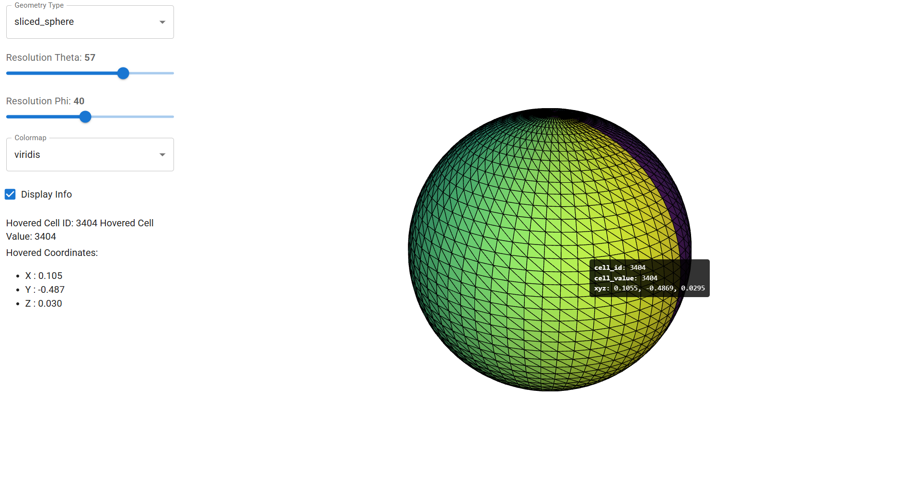

# vtk_panel

Interactive 3D mesh visualization in the browser using Panel and vtk.js.

[]

## Features

- 🎨 Interactive 3D visualization with hover information
- 🔧 Dynamic geometry control via sliders
- 📊 Multiple geometry types: spheres, structured grids, unstructured grids
- 🌈 Configurable colormaps (viridis, plasma, inferno, magma)
- 🚀 Runs in browser - no local VTK installation needed for viewers

## Installation

```bash
pip install -e .
```

Requirements:
- Python >= 3.10
- panel >= 1.0.0
- panel-material-ui >= 0.1.0
- pyvista >= 0.40.0
- vtk >= 9.0.0
- matplotlib >= 3.5.0
- numpy >= 1.20.0
- param >= 2.0.0

## Usage

Run the example application:

```bash
python -m vtk_panel.example
```

This launches a web server and opens a browser window with:
- **Geometry Type selector**: Choose between sliced_sphere, structured_grid, or unstructured_grid
- **Resolution sliders**: Control mesh resolution (theta and phi)
- **Colormap selector**: Change the color scheme
- **Display Info toggle**: Show/hide hover information panel
- **3D viewer**: Interactive visualization with cell hover feedback

## Project Structure

```
vtk_js/
├── vtk_panel/
│   ├── __init__.py
│   ├── plotter.py      # VTKPlotter component and conversion functions
│   └── example.py      # Example implementation with geometry creation
├── tests/
│   └── test_example.py # Pytest tests
├── pyproject.toml      # Package configuration
├── AGENT.md            # Developer documentation
└── README.md           # This file
```
